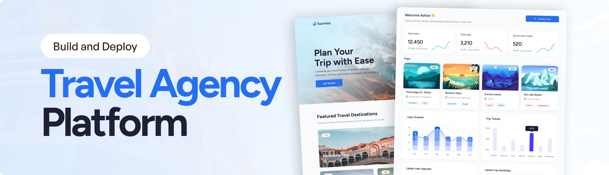

<br />
      
    </a>
  <br />
  <div>
    
    
    
    
  </div>
  <h3 align="center">Travel Agency Platform</h3>

## <a name="tech-stack">⚙️ Tech Stack</a>

- Syncfusion
- React Router v7 (framework mode)
- Appwrite
- Tailwind CSS
- Vite
- React 19

## Features

- 🚀 Server-side rendering
- ⚡️ Hot Module Replacement (HMR)
- 📦 Asset bundling and optimization
- 🔄 Data loading and mutations
- 🔒 TypeScript by default
- 🎉 TailwindCSS for styling
- 📖 [React Router docs](https://reactrouter.com/)

  ### Features of the Travel Agency Project

👉 AI-powered trip itinerary generator

👉 Trip booking functionality on the public website

👉 Admin dashboard with trip and user management

👉 User growth metrics and trip analytics

👉 Interactive charts and trip statistics table

👉 Detailed trip overview

👉 Responsive UI with a modern design

👉 Secure user authentication and data management

👉 Modular code architecture with reusable components

## Getting Started

### Installation

Install the dependencies:

```bash
npm install
```

**Set Up Environment Variables**

Create a new file named `.env` in the root of your project and add the following content:

```env
VITE_SYNCFUSION_LICENSE_KEY=
VITE_APPWRITE_PROJECT_ID=
VITE_APPWRITE_API_ENDPOINT=
VITE_APPWRITE_API_KEY=
VITE_APPWRITE_DATABASE_ID=
VITE_APPWRITE_USERS_COLLECTION_ID=
VITE_APPWRITE_ITINERARY_COLLECTION_ID=
STRIPE_SECRET_KEY=
GEMINI_API_KEY=
UNSPLASH_ACCESS_KEY="
VITE_BASE_URL="http://localhost:5173"
```

### Replace the placeholder values with your actual credentials.

- **[Syncfusion](https://jsm.dev/tourvisto-syncfusion)**

- **[Appwrite](https://jsm.dev/tourvisto-appwrite)**

- **[Gemini AI](https://aistudio.google.com/)**

- **[Sentry](https://jsm.dev/tourvisto-sentry)**

- **[Stripe](https://stripe.com/)**

- **[Unsplash](https://unsplash.com/)**

```bash
npm run dev
```

  
# Outputs
Sign-in – Enables users to securely log in to the platform.
  
  
Dashboard – Displays an overview of user activities and available features.
  
  
AI Trip Creation – Uses Gemini for text generation and Unsplash for images based on user-provided questions.
  

Image Generation (Unsplash) – Fetches relevant, high-quality images from Unsplash based on the trip context.
  

Text Generation (Gemini) – Produces descriptive and engaging trip content using Google's Gemini AI.
  
  
  
